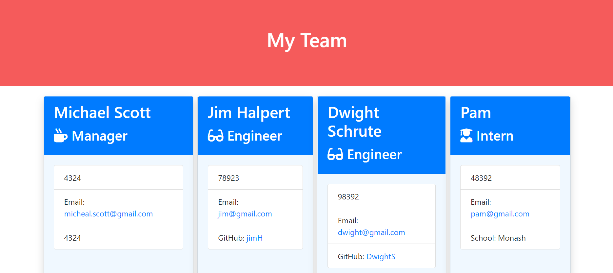

# TEAM PROFILE GENERATOR

## Introduction

This application was created to generate a team profile based on user input using the Inquirer module from Node.js and displaying the information on a newly created html page with a style sheet. This project demonstrates use of OOP and TDD using Jest.

## Table of Contents

- [Installation](#Installation)
- [Usage](#Usage)
- [Tests](#Tests)
- [Assets](#Assets)
- [Questions](#Questions)

## Installation

- Clone Repository
- Run npm install on the command line in your root directory to install dependencies that will enable app to run on your local machine

## Usage

- The following is the link to walk-through video demonstrates the usage of the applciation. 
  

## Tests

- Run 'npm test' in the terminal to run Jest for tests on constructors.
- The following is a gif on the demo of tests
  
- The following is the screenshot of the test results in terminal.
  

## Assets

- The following is the screenshot of the webpage generated
  
- The followings is the link to the deployed code : https://github.com/SrilalithaN/Team-Profile-Generator

## Questions

- If you have any questions please contact me at my github.
- My github user-name is [SrilalithaN](https://github.com/SrilalithaN)
